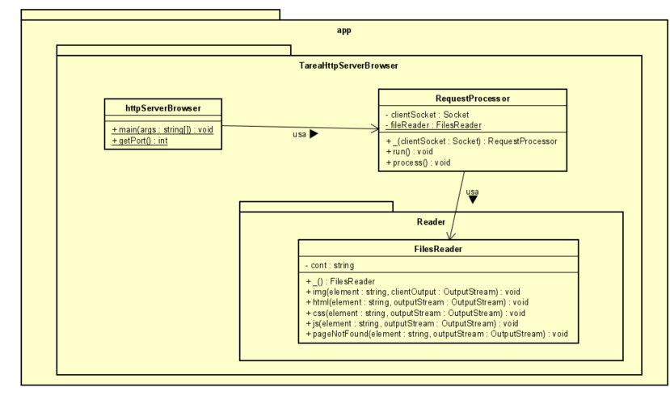

# Tarea ARSW Inter (HttpServer Concurrente que lee imagenes, js, css y html)

## Autor
Julian Adolfo Peña Marin

## Descripcion
La aplicacion es una version del servidor http realizado anteriormente pero esta vez se hizo que fuera un servisor concurrente, que devuelve archivos con extensiones css que son archivos de estilo, extensiones "js" que son archivos javascript, extensiones "html" que muestra como tal una pagina web y una imagen.

Adicionalmente la aplicacion esta desplegada en Heroku, para esto se creo un archivo llamado Procfile, para que heroku entendiera que era una aplicacion web.

## Documentacion
Para obtener la documentacion del proyecto, con el siguiente comando se puede generar:

```
    mvn javadoc:javadoc
```

## Como Correrlo
Primero se debe clonar el repositorio, para esto puede utilizar el siguiente comando de git, con la url del repositorio que se quiere clonar, como se muestra a continuación

```
    git clone https://github.com/JulianP-24/Tarea-Servidor-Web-Concurrente-Arsw-Inter.git
```

Una vez clonado para generar el JAR, debe poner el siguiente comando

```
    mvn package
```

Despues puede correrlo con el siguiente comando, ubicandose en la carpeta raiz
```
    java -cp "./target/classes/" edu.escuelaing.arsw.app.TareaHttpServerBrowser.httpServerBrowser
```

Otra forma para correrlo, ya generado el JAR, es con el siguiente comando

```
    java -cp "target/TareaServidorWebConcurrente-1.0-SNAPSHOT.jar" edu.escuelaing.arsw.app.TareaHttpServerBrowser.httpServerBrowser
```

## Funcionamiento de la aplicacion localmente
Para verificar el funcionamiento, lo que se hace es poner a correr el programa con cualquiera de los comandos mencionados anteriormente. Una vez este corriendo podremos acceder a la ruta con los archivos que queremos que devuelva. La ruta es la siguiente

```
    http://localhost:4567/"Archivo que se quiere buscar"
```
Donde 
 * 35001 es el puerto por el que corre la aplicacion

Para devolver una imagen, se ingresa a la siguiente ruta

```
    http://localhost:4567/valorant.jpg
```
Como resultado se obtiene la imagen:


Para devolver una archivo js, se ingresa a la siguiente ruta

```
    http://localhost:4567/index.js
```
Como resultado se obtiene la imagen:


Para devolver una archivo css, se ingresa a la siguiente ruta

```
    http://localhost:4567/style.js
```
Como resultado se obtiene la imagen:


Para devolver una archivo html, se ingresa a la siguiente ruta

```
    http://localhost:4567/index.html
```
Como resultado se obtiene la pagina html, donde se carga el javaScript como se muestra en la siguiente imagen:


Y despues muestra la pagina con el css aplicado


## Link Heroku

Link: https://cryptic-castle-98984.herokuapp.com/

## Funcionamiento de la Aplicacion en Heroku

Para verificar el funcionamiento de la aplicacion en Heroku, solo se accede al link de heroku, mostrado anteriormente, como se muestra a continuacion:

Para devolver el html, en el siguiente link

```
    https://cryptic-castle-98984.herokuapp.com/
```

Como resultado se obtiene


Para devolver el js, en el siguiente link

```
    https://cryptic-castle-98984.herokuapp.com/index.js
```
Como resultado se obtiene


y asi para los demas archivos, solo se le cambia al final el archivo que se queira devolver.

## Diagrama de Clases
A continuacion se presenta el diagrama de clases de la arquitectura para la tarea propuesta



Como se puede observar la arquitectura se encuentra dentro de tres paquetes, el primero de ellos es el paquete con nombre app, el cual es el principal y en donde estan contenidos los otros dos, el segundo paquete es el que tiene como nombre TareaHttpServerBrowser, el cual tiene la clase principal y otro paquete de nombre Reader. En la clase principal se tiene el metodo main , que es donde esta la implementacion del servidor y en donde verifica la extension del archivo que le llega al path, una vez verificado llama a uno de los metodos de la clase que esta en el paquete Reader para obtener el resultado correcto.
